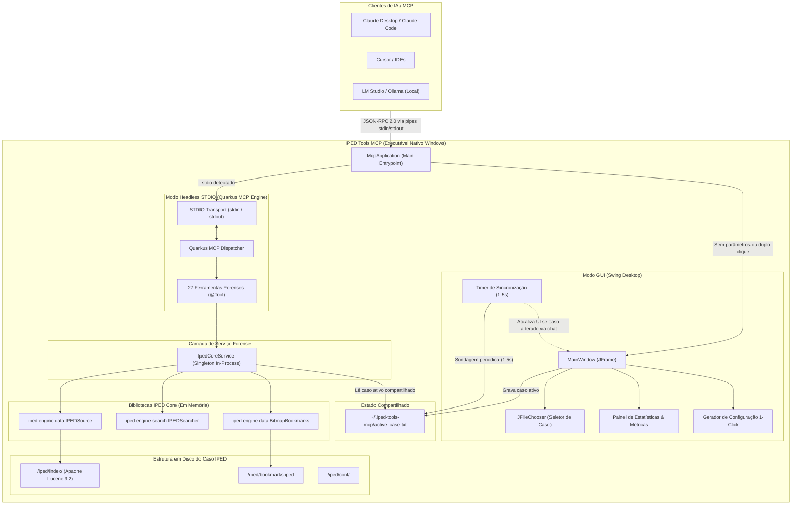
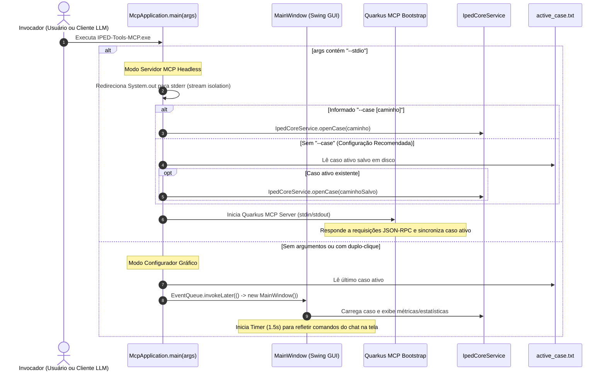

# IPED Tools MCP

[](pom.xml)
[](https://openjdk.org/projects/jdk/21/)
[](https://quarkus.io/)
[](https://modelcontextprotocol.io/)
[](LICENSE)
[](https://www.ipedtools.com.br)

**IPED Tools MCP** é um servidor nativo baseado na especificação **Model Context Protocol (MCP)** que conecta Modelos de Linguagem e Inteligências Artificiais (como Claude Desktop, Claude Code, Cursor, Goose, LM Studio, Ollama e agentes autônomos) diretamente a casos processados pelo **IPED (Indexador e Processador de Evidências Digitais)**.

Elimina intermediários de rede e servidores HTTP legados, permitindo que a IA interrogue diretamente os índices Apache Lucene e metadados estruturados do IPED em memória de processo, com alto desempenho, preservação da cadeia de custódia e garantia de operação 100% desconectada (air-gapped).

---

## 🌐 Distribuição Oficial e Código-Fonte

- **Download Oficial de Executáveis e Instaladores:** [https://www.ipedtools.com.br](https://www.ipedtools.com.br)
- **Repositório de Código-Fonte:** [https://github.com/thiagofuer/iped-tools-mcp](https://github.com/thiagofuer/iped-tools-mcp)

Os binários compilados para Windows (pacote portátil `.zip` e instalador `.msi` com runtime Java 21 embutido) e os manifestos criptográficos `SHA256SUMS.txt` são distribuídos através do portal oficial [www.ipedtools.com.br](https://www.ipedtools.com.br).

---

## 🎯 Personas e Perfis de Uso

O IPED Tools MCP foi projetado para atender aos diferentes atores do ecossistema de persecução penal e investigação digital:

| Perfil | Foco de Atuação | Como o IPED Tools MCP Potencializa o Trabalho |
|---|---|---|
| **Perito Criminal / Perito Oficial** | Rigor técnico, preservação de cadeia de custódia, fundamentação do laudo pericial e auditoria de evidências. | Consultas precisas em metadados estructurados (EXIF, chats, geolocalização), extração de texto paginada, marcação de triagem para o laudo (`set_item_checked`) e inclusão em marcadores periciais (`add_to_bookmark`). |
| **Analista de Inteligência Policial** | Identificação de padrões, vínculo entre suspeitos, fluxos financeiros e cronologia dos fatos. | Análise de grafos de comunicação (`get_communications_graph`), ranking de interlocutores mais frequentes (`get_top_contacts`), reconstrução de eventos ao redor de um marco temporal (`get_events_around_time`) e cruzamento de duplicatas por hash (`get_item_relations`). |
| **Autoridade Policial / Delegado / Promotor** | Visão executiva da investigação, respostas a quesitos formulados e tomada rápida de decisões. | Resumos executivos de casos (`get_case_summary`), identificação rápida de alvos/dispositivos (`get_device_and_owner_info`), filtros automáticos de IA para detecção de armas/drogas/faces e busca multimodal por similares. |

---

## 🏛 Arquitetura do Sistema



---

## 🔄 Fluxo de Vida e Execução em Modo Duplo (Dual-Mode)

O executável possui roteamento inteligente de entrada através de `McpApplication.java`:



---

## 🛡 Princípios Forenses, Cadeia de Custódia e Limites Operacionais

1. **Acesso Estritamente Somente-Leitura (Read-Only):**
   - O leitor Lucene opera exclusivamente em modo `ReadOnly` sobre os índices e as bases SQLite originais.
   - Nenhuma evidência bruta ou índice de pesquisa é alterado durante as sessões de investigação.
   - As únicas operações de gravação permitidas são os marcadores periciais (`bookmarks.iped`) e o estado de conferência/triagem (`set_item_checked`), permitindo que a IA registre descobertas para auditoria posterior pelo perito no IPED Desktop.
2. **Operação 100% Desconectada (Air-Gapped & Offline):**
   - O IPED Tools MCP não abre portas de escuta de rede (TCP/UDP), não realiza chamadas externas e não possui telemetria.
   - A comunicação ocorre estritamente pelos pipes locais de entrada/saída padrão (`stdin`/`stdout`) com o processo cliente.
   - Totalmente compatível com laboratórios periciais em redes isoladas utilizando modelos locais (LM Studio / Ollama).
3. **Isolamento de Streams (Stream Isolation):**
   - O descritor `stdout` é estritamente reservado para os frames JSON-RPC 2.0 do protocolo MCP.
   - Todos os logs operacionais, diagnósticos do Quarkus, avisos do Lucene e Tika são redirecionados automaticamente para `stderr`.
4. **Padrão de Engenharia de Prompts Anti-Alucinação:**
   - Todas as 27 ferramentas declaram metadados rigorosos contendo instruções de fluxo (*workflow guidance*), regras negativas explícitas (ex: *"NUNCA busque por 'proprietario' em busca textual, chame get_device_and_owner_info"*), catálogos exaustivos de valores válidos e sintaxes de consulta Lucene com escape de caracteres especiais.
5. **Fronteiras Operacionais e Não-Metas (Non-Goals):**
   - **Extração Pesada de Arquivos e Relatórios Oficiais:** A exportação física em massa de arquivos e a geração do laudo em HTML/PDF continuam sob responsabilidade exclusiva da interface oficial do **IPED Desktop**. Com isso, o MCP permanece leve, seguro e focado na triagem e no raciocínio investigativo cognitivo.

---

## 🧰 Catálogo de Ferramentas Forenses (27 MCP Tools)

### 1. Conectividade e Gestão de Casos
- `get_server_status`: Retorna o status de conexão do servidor MCP, versão instalada e detalhes do caso aberto.
- `check_connection`: Alias para `get_server_status`: validação rápida de conectividade e prontidão pericial.
- `list_sources`: Lista as fontes de evidência carregadas no caso (discos, aparelhos móveis, imagens forenses) e seus caminhos.
- `get_case_summary`: Resumo estatístico do caso (total de itens, quantitativo de categorias, marcadores e fontes).
- `open_case`: Carrega ou alterna dinamicamente o caso pericial ativo em tempo de execução sem reiniciar o processo.

### 2. Dicionário e Descoberta de Metadados
- `get_property_dictionary`: Dicionário semântico e catálogo estruturado de propriedades forenses por domínio (`chats`, `browsers`, `emails`, `media`, `system`, `gps`, `ufed`, `ai` com redes neurais, e `crypto` para carteiras de hardware).
- `list_available_properties`: Descobre dinamicamente os nomes exatos de campos e propriedades indexadas no caso para uma categoria específica.

### 3. Busca e Extração de Conteúdo
- `search_documents`: Executa consultas estruturadas em sintaxe Lucene no índice pericial (`category:"chat messages" AND content:propina`).
- `get_document_metadata`: Recupera metadados técnicos forenses de itens, suportando modo sumarizado padrão particionado em blocos semânticos (`basic`, `communication`, `geo`, `forensic`, `extra`), extração fidedigna sem truncamento (`raw: true`) e filtragem cirúrgica de campos (`keys` com suporte a wildcards, ex: `["Hardware-Wallet-*", "ai:*"]`).
- `get_document_text`: Extrai texto completo processado pelo OCR ou parsers nativos do IPED com suporte a paginação.
- `list_categories`: Lista todas as categorias de evidências presentes no caso e seus quantitativos.
- `list_bookmarks`: Lista os marcadores periciais do caso e total de documentos marcados.
- `add_to_bookmark`: Adiciona um ou mais itens a um marcador pericial existente ou cria um novo marcador.

### 4. Inteligência de Comunicações e Dispositivos
- `get_device_and_owner_info`: Identifica dados do proprietário do dispositivo, contas vinculadas, IMEI, números de telefone e e-mails (via regex profundas `Regex:PHONE` e `Regex:EMAIL`), agrupando múltiplos contêineres de evidências (.E01, UFED, GrayKey) sob `evidences` e classificando casos mistos como `hybrid`.
- `get_top_contacts`: Ranking de contatos mais frequentes em mensagens, chamadas e aplicativos de comunicação.
- `get_communications_graph`: Extrai o grafo relacional de comunicações (nós e arestas de interlocutores, volume de mensagens e chamadas trocadas).

### 5. Análise Cronológica e Temporal
- `get_timeline`: Linha do tempo unificada de eventos do caso (mensagens, arquivos criados, conexões, acessos web) em intervalo ISO-8601.
- `get_events_around_time`: Janela de correlação temporal em torno de um instante-chave (+/- N minutos) para reconstrução do momento do fato.

### 6. Navegação e Árvore de Evidências
- `list_folder_contents`: Navega pela árvore de diretórios virtuais ou lógicos das mídias periciadas no caso.
- `get_item_relations`: Mapeia hierarquia pericial completa (item pai, subitens contidos e cópias duplicadas por hash em qualquer dispositivo).

### 7. Triagem Pericial
- `set_item_checked`: Marca ou desmarca o status de conferência/triagem pericial de um item evidência (*checkbox* do IPED Desktop).

### 8. Análise Multimodal e Similaridade
- `get_item_thumbnail`: Retorna a miniatura visual de imagens e vídeos codificada em Base64 JPEG como bloco multimodal do protocolo MCP.
- `search_similar_images`: Busca reversa por imagens visualmente semelhantes utilizando assinaturas perceptuais (pHash/perceptual hash).
- `search_similar_faces`: Busca por faces similares às detectadas no item de referência via reconhecimento facial.
- `search_similar_documents`: Busca por documentos textualmente semelhantes via vetores semânticos / Lucene MoreLikeThis.

### 9. Filtros de Inteligência Artificial e Reconhecimento
- `list_ai_filters`: Lista as categorias de detecções por IA disponíveis no caso (faces, nudez/NSFW, armas, drogas, transcrições de áudio, CSAM híbrido, carteiras cripto, estimativa de idade de crianças, OCR).
- `query_ai_detections`: Consulta itens classificados por filtros específicos de Inteligência Artificial (`weapons`, `drugs`, `nudity`, `nsfw`, `faces`, `age_estimation`, `audio_transcripts`, `csam`, `crypto_wallets`, `ocr`) com limiares de confiança e pontuações calculadas por redes neurais.

---

## 📜 Prompts Forenses MCP (MCP Prompts)

O servidor implementa o recurso de **Prompts MCP** (`prompts/list` e `prompts/get`), provendo orientações operacionais padronizadas que preparam o modelo de linguagem para atuar com rigor metodológico pericial:

- **`start_case`**: Inicializa a sessão pericial injetando o contexto do caso aberto, regras estritas de não-destrutividade (leitura exclusiva), metodologia de triagem probatória e a diretiva de **Dynamic Language Mirroring** (saudação inicial em português brasileiro, adaptando-se fluentemente ao idioma utilizado pelo perito).

---

## 🚀 Instalação e Uso

### Configuração no Claude Desktop

Adicione a seguinte configuração ao arquivo `claude_desktop_config.json` do seu ambiente:

```json
{
  "mcpServers": {
    "iped-tools": {
      "command": "C:\\Program Files\\IPED Tools MCP\\IPED-Tools-MCP.exe",
      "args": [
        "--stdio"
      ]
    }
  }
}
```

> **Nota:** Não é necessário fixar o parâmetro `--case`! O IPED Tools MCP sincroniza automaticamente com o último caso selecionado na interface gráfica ou via ferramenta `open_case`.

### Configuração no LM Studio (Modelos Locais)

1. No LM Studio, acesse a aba **Program / MCP Servers**.
2. Clique em **Add MCP Server**.
3. No campo **Command**, informe o caminho do executável (ex: `C:\Program Files\IPED Tools MCP\IPED-Tools-MCP.exe`).
4. No campo **Arguments**, informe apenas `--stdio`.

---

## 💻 Opções de Linha de Comando (CLI)

O executável suporta os seguintes parâmetros de linha de comando:

| Flag | Descrição |
|---|---|
| `--stdio` | Inicia o servidor em modo STDIO MCP (comunicação via JSON-RPC 2.0 através de `stdin` e `stdout`). |
| `--case <caminho>` | Define o caminho da pasta do caso IPED a ser pré-carregada na inicialização (opcional). |
| `--version`, `-v` | Exibe a versão do produto, data do build, runtime Java e versão do IPED Core, saindo imediatamente com código 0. |
| `--help`, `-h` | Exibe a ajuda detalhada com a sintaxe de uso e parâmetros suportados. |

---

## 🛠 Compilação e Empacotamento

### Pré-requisitos
- **Java Development Kit (JDK):** Versão 21 (LTS) de 64 bits.
- **Apache Maven:** Versão 3.8.0 ou superior.
- **PowerShell:** Versão 5.1 ou superior.
- **WiX Toolset v3.11:** Necessário apenas para o instalador `.msi` (o script `scripts/package_msi.ps1` resolve automaticamente).

### 1. Compilação do Runner JAR
```powershell
mvn clean package -DskipTests
```
O artefato compilado é gerado em `target/iped-tools-mcp-*-runner.jar`.

### 2. Execução dos Testes Automatizados
```powershell
# Execução dos testes unitários Maven (52 testes com resolução dinâmica via TestCaseResolver)
mvn test

# Testes de integração ponta a ponta do protocolo STDIO MCP
powershell -ExecutionPolicy Bypass -File scripts\test_stdio_mcp.ps1 -CasePath "C:\casos_forenses\caso_operacao_01"

# Testes de integração do executável nativo Windows
powershell -ExecutionPolicy Bypass -File scripts\test_native_exe.ps1 -CasePath "C:\casos_forenses\caso_operacao_01"
```

### 3. Empacotamento Nativo Windows (.exe e .zip portátil)
```powershell
powershell -ExecutionPolicy Bypass -File scripts\package_app.ps1
```
Gera a pasta nativa em `dist/IPED-Tools-MCP/` e o pacote portátil em `dist/IPED-Tools-MCP-1.0.0-windows-x64-portable.zip`, com JRE Liberica 21 embutido e manifesto `dist/SHA256SUMS.txt`.

### 4. Empacotamento do Instalador MSI
```powershell
powershell -ExecutionPolicy Bypass -File scripts\package_msi.ps1
```
Gera o instalador Windows em `dist/IPED-Tools-MCP-1.0.0.msi` com integração ao Painel de Controle e atalhos na Área de Trabalho e Menu Iniciar.

---

## 🛡 Integridade Criptográfica

Para ambientes de perícia oficial e cadeia de custódia digital, todos os pacotes distribuídos possuem hashes SHA-256 publicados no arquivo `dist/SHA256SUMS.txt`. Para verificar a integridade do pacote baixado:

```powershell
Get-FileHash -Algorithm SHA256 "dist\IPED-Tools-MCP-1.0.0-windows-x64-portable.zip"
```

---

## 📄 Governança e Contribuição

- O fluxo de desenvolvimento segue o **GitFlow Tradicional** (`main`, `develop`, `feature/*`, `release/*`, `hotfix/*`).
- O versionamento segue rigorosamente a especificação **Semantic Versioning 2.0.0**.
- Para detalhes sobre padrões de código, fluxo de PRs e diretrizes de contribuição, consulte [CONTRIBUTING.md](CONTRIBUTING.md).
- O histórico de alterações de cada versão pode ser consultado em [CHANGELOG.md](CHANGELOG.md).

---

## ⚖ Licença

Distribuído sob a licença **GPLv3** (GNU General Public License v3.0). Consulte o arquivo [LICENSE](LICENSE) para mais informações.
