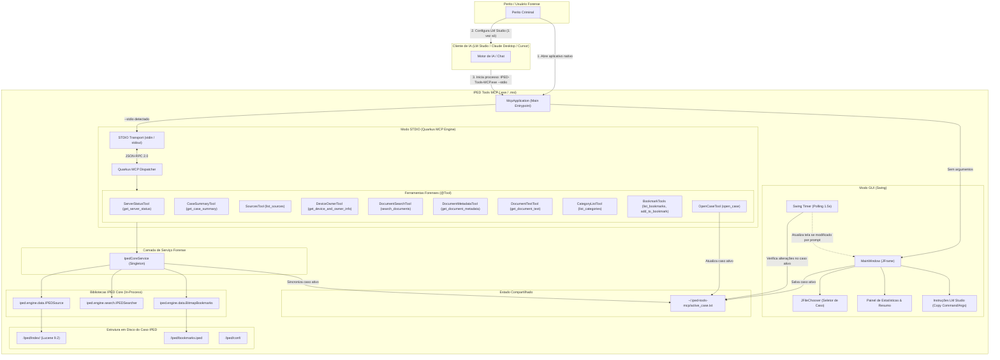

# Software Design Document (SDD) — IPED Tools MCP

**Versão:** 1.0.1  
**Data:** 2026-09-27  
**Status:** Implementado e Validado  
**Referência:** [PRD.md](file:///C:/Users/thiag/Downloads/workspace/IPEDToolsMCP/docs/PRD.md)  
**Autor:** Thiago Sampaio Figueiredo  

---

## 1. Visão Geral e Objetivos de Engenharia

O **IPED Tools MCP** é uma aplicação desktop em **Java 21** e **Quarkus 3.x (JVM Mode)** que disponibiliza uma ponte local baseada no protocolo **Model Context Protocol (MCP)** sobre **STDIO (JSON-RPC 2.0)** para o **IPED (Indexador e Processador de Evidências Digitais)**.

### Objetivos Técnicos Fundamentais
1. **Acesso Direto ao Índice:** Eliminar completamente o servidor HTTP intermediário (`iped-webapi`) e o bridge Python (`server.py`). O servidor MCP em Java instancia e interroga as classes do IPED diretamente na memória do processo (`IPEDSource`, `IPEDSearcher`, `IBookmarks`).
2. **Execução em Modo Duplo (Dual-Mode):**
   - **Modo GUI (padrão / duplo clique):** Abre uma interface gráfica intuitiva em **Swing** para selecionar o caso, validar o índice, verificar estatísticas, copiar parâmetros de configuração e acompanhar diagnósticos.
   - **Modo STDIO (invocado pelo cliente LLM):** Roda headless com entrada e saída estritamente em `stdin`/`stdout`, tratando requisições JSON-RPC de forma determinística.
3. **Persistência de Estado e Sincronização Bidirecional:**
   - Estado compartilhado em arquivo desacoplado (`~/.iped-tools-mcp/active_case.txt`).
   - Restauração automática do último caso selecionado ao reabrir a interface gráfica.
   - Sincronização em tempo real: trocas de caso na GUI são detectadas pelo servidor STDIO na próxima chamada; trocas solicitadas via prompt da LLM (ferramenta `open_case`) são refletidas na GUI via timer em segundo plano (1.5s).
4. **Configuração Única e Desacoplada no Cliente LLM:**
   - O cliente LLM (LM Studio, Claude Desktop) é configurado com argumentos agnósticos de caso (`--stdio`). A troca de casos é feita livremente na GUI ou no chat sem exigir reedição das configurações do cliente de IA.
5. **Distribuição Autocontida no Windows:**
   - Empacotamento via **`jpackage`** com JRE 21 Liberica completo e configurações JVM (`--add-opens`, `-Djava.security.manager=allow`), gerando instalador `.msi` e pacote portátil `.exe` sem dependência de Java instalado no sistema do perito.
6. **Isolamento de Streams:** Garantia absoluta de que nenhuma biblioteca de terceiros (Lucene, Tika, Log4j, Quarkus) polua o `stdout` durante o modo STDIO, redirecionando logs para `stderr` e console gráfico.

---

## 2. Diagrama de Arquitetura do Sistema



---

## 3. Fluxo de Vida e Despacho de Modos (Dual-Mode Execution)

O executável utiliza `McpApplication.java` para rotear argumentos de linha de comando:

```mermaid
sequenceDiagram
    autonumber
    actor Trigger as Invocador (Usuário ou Cliente LLM)
    participant Main as McpApplication.main(args)
    participant Swing as MainWindow (Swing GUI)
    participant Quarkus as Quarkus Bootstrap
    participant Service as IpedCoreService
    participant State as active_case.txt

    Trigger->>Main: Executa processo
    alt args contém "--stdio"
        Note over Main: Modo Servidor MCP Headless
        Main->>Main: Redireciona System.out para stderr
        opt Se informado "--case <path>"
            Main->>Service: IpedCoreService.openCase(path)
        else Sem "--case" (Configuração Recomendada)
            Main->>State: Lê caso ativo salvo em disco
            opt Caso ativo existe
                Main->>Service: IpedCoreService.openCase(activePath)
            end
        end
        Main->>Quarkus: Inicia Quarkus MCP Server (stdin/stdout)
        Note over Quarkus: Trata requisições JSON-RPC e sincroniza caso ativo
    else Sem argumentos ou com "--gui"
        Note over Main: Modo Configurador Gráfico
        Main->>State: Lê caso ativo anterior
        Main->>Swing: EventQueue.invokeLater(() -> new MainWindow())
        Swing->>Service: Carrega caso anterior e exibe estatísticas
        Note over Swing: Inicia Timer (1.5s) para live sync com chat
    end
```

---

## 4. Detalhamento dos Componentes

### 4.1 `IpedCoreService.java` (Coração do Acesso aos Dados & Sincronização)

Substitui todas as rotas do Jersey/Grizzly do `iped-webapi`, executando chamadas diretas de biblioteca e gerenciando o estado do caso ativo:

```java
package br.com.ipedtools.mcp.service;

import java.io.File;
import java.io.IOException;
import java.nio.file.*;
import java.util.*;
import org.apache.lucene.document.Document;
import org.apache.lucene.index.IndexableField;
import iped.engine.config.Configuration;
import iped.engine.data.IPEDSource;
import iped.engine.search.IPEDSearcher;
import iped.search.SearchResult;

public class IpedCoreService {
    private static final Path ACTIVE_CASE_FILE = Paths.get(System.getProperty("user.home"), ".iped-tools-mcp", "active_case.txt");
    private static IpedCoreService INSTANCE;
    private IPEDSource ipedSource;
    private File caseDirectory;

    public synchronized static IpedCoreService getInstance() {
        if (INSTANCE == null) {
            INSTANCE = new IpedCoreService();
        }
        return INSTANCE;
    }

    public synchronized void openCase(File caseDir) throws Exception {
        if (!IPEDSource.checkIfIsCaseFolder(caseDir)) {
            throw new IllegalArgumentException("Diretório inválido: estrutura de caso IPED não encontrada em " + caseDir);
        }
        if (this.ipedSource != null) {
            closeCase();
        }
        this.caseDirectory = caseDir;
        Configuration.getInstance().loadConfigurables(caseDir.getAbsolutePath() + File.separator + "iped", true);
        this.ipedSource = new IPEDSource(caseDir);
        saveActiveCasePath(caseDir);
    }

    public synchronized void syncActiveCaseIfNeeded() {
        String savedPath = loadActiveCasePath();
        if (savedPath != null && !savedPath.isBlank()) {
            File savedDir = new File(savedPath);
            if (this.caseDirectory == null || !this.caseDirectory.getAbsolutePath().equalsIgnoreCase(savedDir.getAbsolutePath())) {
                try {
                    openCase(savedDir);
                } catch (Exception e) {
                    System.err.println("Erro ao sincronizar caso ativo: " + e.getMessage());
                }
            }
        }
    }

    public SearchResult executeSearch(String luceneQuery, int limit) throws IOException {
        syncActiveCaseIfNeeded();
        String sanitizedQuery = luceneQuery.replaceAll("/", "\\\\/");
        IPEDSearcher searcher = new IPEDSearcher(ipedSource, sanitizedQuery);
        return searcher.search();
    }

    public Map<String, Object> getDocumentMetadata(int itemId) throws IOException {
        syncActiveCaseIfNeeded();
        int luceneId = ipedSource.getLuceneId(itemId);
        Document doc = ipedSource.getReader().document(luceneId);
        
        Map<String, Object> props = new HashMap<>();
        for (IndexableField field : doc.getFields()) {
            String[] vals = doc.getValues(field.name());
            if (vals != null && vals.length > 0) {
                props.put(field.name(), vals.length == 1 ? vals[0] : vals);
            }
        }
        return props;
    }

    public List<String> listCategories() {
        syncActiveCaseIfNeeded();
        return ipedSource.getLeafCategories();
    }

    public Set<String> listBookmarks() {
        syncActiveCaseIfNeeded();
        return ipedSource.getBookmarks().getBookmarkMap().values().stream()
                         .collect(Collectors.toSet());
    }

    public void addBookmark(String bookmarkName, List<Integer> docIds) {
        syncActiveCaseIfNeeded();
        int bmId = ipedSource.getBookmarks().newBookmark(bookmarkName);
        ipedSource.getBookmarks().addBookmark(docIds, bmId);
        ipedSource.getBookmarks().saveState(true);
    }
}
```

---

### 4.2 Mapeamento das Ferramentas MCP (`@Tool`)

Implementação utilizando a extensão `quarkus-mcp-server-stdio`:

| ID | Nome da Ferramenta | Classe Java | Entrada (Parâmetros) | Saída (Retorno) |
|---|---|---|---|---|
| **MCP-01** | `get_server_status` | `ServerStatusTool` | *(Nenhum)* | `Record` com status, caseName e paths |
| **MCP-02** | `get_case_summary` | `CaseSummaryTool` | `source_id` (opcional) | Total de itens, categorias e marcadores |
| **MCP-03** | `list_sources` | `SourcesTool` | *(Nenhum)* | Lista de fontes de dados no caso |
| **MCP-04** | `get_device_and_owner_info` | `DeviceOwnerTool` | `source_id` (opcional) | Proprietário, IMEI, telefones, contas |
| **MCP-07** | `search_documents` | `DocumentSearchTool` | `query` (Lucene), `limit` | IDs e trechos de documentos |
| **MCP-08** | `get_document_metadata` | `DocumentMetadataTool`| `source_id`, `doc_ids` (int[]) | Metadados higienizados |
| **MCP-09** | `get_document_text` | `DocumentTextTool` | `source_id`, `doc_id`, `offset`, `max_chars` | Texto paginado com offset |
| **MCP-10** | `list_categories` | `CategoryListTool` | *(Nenhum)* | Lista de nomes de categorias |
| **MCP-11** | `list_bookmarks` | `BookmarkListTool` | *(Nenhum)* | Lista de bookmarks existentes |
| **MCP-12** | `add_to_bookmark` | `BookmarkAddTool` | `bookmark_name`, `doc_ids` | Confirmação de inclusão no marcador |
| **MCP-13** | `open_case` | `OpenCaseTool` | `case_path` (String) | Confirmação de abertura e resumo |

---

### 4.3 Design da Interface Gráfica Swing (`MainWindow.java`)

A interface foi projetada para ter zero atrito com o usuário e manter feedback visual permanente:

```text
+---------------------------------------------------------------------------------------+
|  IPED Tools MCP — Assistente Forense de Inteligência Artificial               [ _ X ] |
+---------------------------------------------------------------------------------------+
|                                                                                       |
|  Caso IPED Selecionado:                                                               |
|  [ C:\casos_forenses\caso_operacao_01                                ] [ Procurar... ] |
|                                                                                       |
|  Status do Caso:                                                                      |
|  ✔ Caso carregado: C:\casos_forenses\caso_operacao_01                                  |
|  • Total de Itens: 1.856                       • Categorias: 43                       |
|  • Marcadores Existentes: 2                    • Estado: Sincronizado                 |
|                                                                                       |
+---------------------------------------------------------------------------------------+
|  Como Configurar no LM Studio (Configuração Única)                                    |
|                                                                                       |
|  1. No LM Studio, acesse a aba Program / MCP Servers e clique em "Add MCP Server".    |
|  2. Preencha os campos com os valores abaixo (copie com 1 clique):                    |
|                                                                                       |
|  Comando (Command):                                                                   |
|  [ C:\Users\...\IPEDToolsMCP\dist\IPED-Tools-MCP\IPED-Tools-MCP.exe ] [ Copiar Cmd ]  |
|                                                                                       |
|  Argumentos (Arguments):                                                              |
|  [ --stdio                                                          ] [ Copiar Args ] |
|                                                                                       |
|  [ ] Fixar caso no comando (--case)                                                   |
|  Dica: Use barras normais (/) ou simples (\). O LM Studio responde sobre o caso       |
|  selecionado na interface ou trocado dinamicamente no chat!                           |
+---------------------------------------------------------------------------------------+
|  Console de Diagnóstico em Tempo Real:                                                |
|  [19:27:01] IPED Tools MCP iniciado.                                                  |
|  [19:27:02] Caso ativo restaurado automaticamente: C:\casos_forenses\caso_opera...    |
|  [19:28:15] Sincronização em tempo real ativada (1.5s timer ativo).                    |
|                                                                                       |
+---------------------------------------------------------------------------------------+
```

---

## 5. Estratégia de Empacotamento e Distribuição

### 5.1 Pipeline de Compilação e Distribuição Windows

O processo de build foi automatizado em três etapas via scripts PowerShell:

1. **Compilação Uber-JAR:**
   ```powershell
   mvn clean package -DskipTests -Dquarkus.package.jar.type=uber-jar
   ```
   Gera `target/iped-tools-mcp-1.0.0-SNAPSHOT-runner.jar`.

2. **Geração do Pacote Portátil Nativo (`scripts/package_app.ps1`):**
   Utiliza o `jpackage` do JDK 21 para gerar a pasta `dist/IPED-Tools-MCP/` com o executável `IPED-Tools-MCP.exe` e o JRE Liberica 21 completo embutido.
   - Configura em `app/IPED-Tools-MCP.cfg` as opções obrigatórias para o motor IPED:
     ```ini
     java-options=--add-opens=java.base/java.math=ALL-UNNAMED
     java-options=--add-opens=java.base/java.lang=ALL-UNNAMED
     java-options=-Djava.security.manager=allow
     ```

3. **Geração do Instalador Windows MSI (`scripts/package_msi.ps1`):**
   Produz o instalador `dist/IPED-Tools-MCP-1.0.0.msi` (~349 MB) com atalhos na Área de Trabalho e Menu Iniciar.

4. **Validação Automatizada do Executável Nativo (`scripts/test_native_exe.ps1`):**
   Executa testes ponta a ponta chamando o binário `IPED-Tools-MCP.exe` sobre STDIO:
   - Inicialização e `get_server_status`.
   - Consulta `get_case_summary`.
   - Alternância dinâmica de caso para outro caso no disco via `open_case`.
   - Busca de evidências no novo caso.

---

## 6. Segurança e Preservação da Cadeia de Custódia

1. **Acesso Exclusivamente Local:** A comunicação STDIO ocorre exclusivamente entre o processo pai (cliente LLM) e o processo filho (IPED Tools MCP) por descritores de pipe do Windows. Nenhuma porta de rede (TCP/UDP) é aberta.
2. **Imutabilidade das Evidências:**
   - O leitor Lucene opera estritamente como `ReadOnly`.
   - O único arquivo passível de alteração no caso é `bookmarks.iped`, permitindo que a IA registre marcadores que o perito poderá auditar na interface padrão do IPED.
   - O arquivo de persistência do caso ativo (`~/.iped-tools-mcp/active_case.txt`) reside exclusivamente no diretório do usuário do sistema operacional, sem tocar os arquivos da evidência.

---

## 7. Status e Próximos Passos

O sistema está 100% implementado, empacotado e validado em ambiente Windows nativo com suporte a LM Studio e Claude Desktop. O backlog e histórico de tarefas detalhado encontram-se em **`docs/TASKS.md`**.
