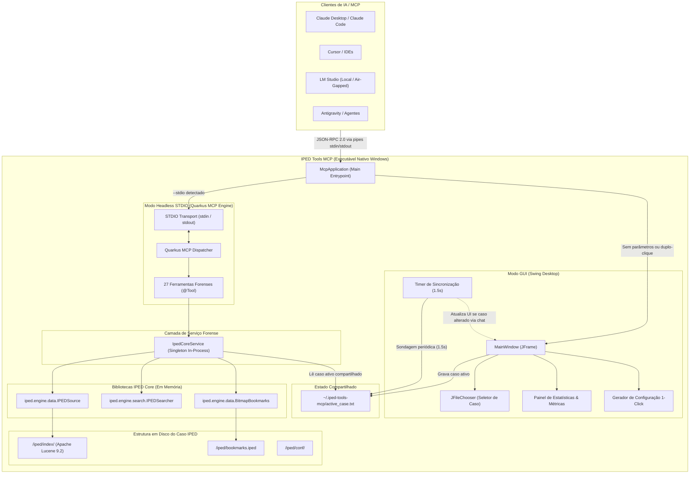
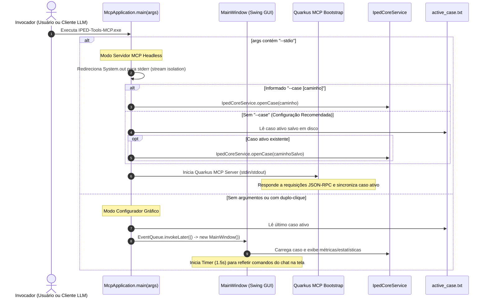

# Arquitetura e Fluxo de Execução

O **IPED Tools MCP** é construído sobre o ecossistema **Java 21 (LTS)** e **Quarkus 3.x**, operando como um processo nativo do Windows que integra diretamente as bibliotecas internas do IPED Core e do Apache Lucene sem intermediários de rede.

---

## 🏛 Diagrama de Arquitetura do Sistema

---

## 🔄 Fluxo de Vida e Execução em Modo Duplo (Dual-Mode)

O ponto de entrada `McpApplication.main(args)` inspeciona os argumentos de execução e roteia o ciclo de vida da aplicação:

---

## 💻 Opções de Linha de Comando (CLI)

O executável nativo suporta os seguintes parâmetros formais:

| Parâmetro | Descrição | Comportamento Operacional |
|---|---|---|
| `--stdio` | Inicia o servidor em modo STDIO MCP. | Desativa a interface gráfica, isola o fluxo `stdout` para JSON-RPC e aguarda requisições na entrada padrão. |
| `--case <caminho>` | Especifica um caso IPED fixo na inicialização. | Opcional. Quando omitido, o servidor utiliza o caso salvo em `~/.iped-tools-mcp/active_case.txt`. |
| `--version`, `-v` | Exibe os dados de versão e licença. | Imprime versão, data do build, runtime Java e versão do IPED Core na saída padrão e finaliza imediatamente com código 0. |
| `--help`, `-h` | Exibe a ajuda da linha de comando. | Lista todos os parâmetros suportados com exemplos de uso. |
